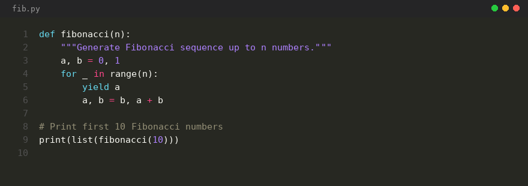

# Pygments Renderer

[](LICENSE)
[](https://pypi.org/project/pygments-renderer/)
[](https://pypi.org/project/pygments-renderer/)

A CLI tool that generates syntax-highlighted code screenshots as PNG images. Designed for developers, educators, and content creators who need beautiful code screenshots for presentations, documentation, or social media.

## Features

- **Automatic Language Detection**: Uses Pygments `guess_lexer` to automatically detect the programming language.
- **48 Built-in Themes**: Choose from 48 Pygments color schemes (monokai, dracula, nord, solarized-dark, etc.).
- **Dynamic Background**: Background color is automatically set from the chosen theme.
- **Custom Width**: Adjust image width for different code lengths.
- **Custom Title**: Set the window title bar text.
- **Universal Language Support**: Works with any of the 575+ languages supported by Pygments.

## Technologies Used

- **Python 3**: Runtime
- **Pygments**: Syntax highlighting and language detection
- **Pillow (PIL)**: Image generation

## Prerequisites

- **Python** ≥ 3.8

### Installation

```bash
pip install -e .
```

Or install dependencies directly:

```bash
pip install Pillow Pygments
```

## Getting Started

1. Clone the repository:
   ```bash
   git clone https://github.com/ChernegaSergiy/pygments-renderer.git
   ```

2. Install dependencies:
   ```bash
   pip install -e .
   ```

3. Generate a screenshot:
   ```bash
   pygments-renderer input.cpp -o code.png
   ```

## Usage

```
usage: pygments-renderer [-h] [-o OUTPUT] [-l LANGUAGE] [-t THEME] [-w WIDTH]
                         [-s START] [-f FONT] [-T TITLE]
                         input

Generate syntax-highlighted code screenshots

positional arguments:
  input                 Input file path

options:
  -h, --help            show this help message and exit
  -o OUTPUT, --output OUTPUT
                        Output image path (default: output.png)
  -l LANGUAGE, --language LANGUAGE
                        Language (e.g., cpp, python, html, html+php)
  -t THEME, --theme THEME
                        Color theme (default, monokai, dracula, etc.)
  -w WIDTH, --width WIDTH
                        Image width (default: 880)
  -s START, --start START
                        Starting line number (default: 1)
  -f FONT, --font FONT  Font file path or system font name
  -T TITLE, --title TITLE
                        Window title
```

## Examples



**Basic usage (auto-detect language):**
```bash
pygments-renderer examples/task1.cpp -o code.png
```

**Specify language and theme:**
```bash
pygments-renderer input.py -t dracula -o code.png
```

**Custom width and title:**
```bash
pygments-renderer main.rs -w 1200 -T "Rust Source" -o output.png
```

**Use with HTML + PHP:**
```bash
pygments-renderer template.php -l html+php -t solarized-dark -o screenshot.png
```

**Custom starting line number:**
```bash
pygments-renderer input.cpp -s 10 -o code.png
```

**Custom font:**
```bash
pygments-renderer input.cpp -f "Consolas" -o code.png
pygments-renderer input.cpp -f /path/to/font.ttf -o code.png
```

## Available Themes

Here are some popular themes you can use with `-t` or `--theme`:

- `monokai` - Dark, purple-tinted (background: #272822)
- `dracula` - Dark, purple/cyan (background: #282a36)
- `nord` - Dark, cool gray (background: #2e3440)
- `gruvbox-dark` - Retro dark (background: #282828)
- `solarized-dark` - Warm dark (background: #002b36)
- `solarized-light` - Warm light (background: #fdf6e3)
- `github-dark` - GitHub dark (background: #0d1117)
- `material` - Material Design (background: #263238)
- `one-dark` - Atom One Dark (background: #282c34)
- `vim` - Vim classic (background: #000000)
- `rrt` - Terminal classic (background: #000000)
- `default` - Pygments default (background: #f8f8f8)

## Contributing

Contributions are welcome and appreciated! Here's how you can contribute:

1. Fork the project
2. Create your feature branch (`git checkout -b feature/AmazingFeature`)
3. Commit your changes (`git commit -m 'Add some AmazingFeature'`)
4. Push to the branch (`git push origin feature/AmazingFeature`)
5. Open a Pull Request

Please make sure to adhere to the existing coding style.

## License

This project is licensed under the CSSM Unlimited License v2.0 (CSSM-ULv2). See the [LICENSE](LICENSE) file for details.